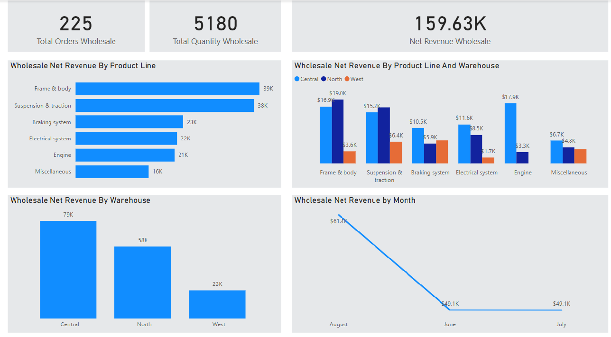

# Motorcycle Part Sales Analysis – Wholesale Net Revenue Insights

Project Overview
This Power BI project analyzes motorcycle parts sales from June to August 2021. The goal is to provide the company's board of directors with valuable insights into wholesale revenue trends across different product lines, months, and warehouses.

### Dataset Overview

The dataset consists of sales data with the following attributes:

 | Field                          | Description |
|-------------------------------|-------------|
| `order_number`                | Unique order number. |
| `date`                        | Date of the order, ranging from June to August 2021. |
| `warehouse`                   | The Warehouse location where the order was placed (North, Central, or West). |
| `client_type`                 | Specifies whether the order was Retail or Wholesale. |
| `product_line`                | Type of product ordered. |
| `quantity`                    |Number of products ordered.|
| `unit_price`                  | Price per product in dollars.|
| `total`                       |  Total order price in dollars. |
| `payment` | Payment method used (Credit Card, Transfer, or Cash). |
| `payment_fee`|  Percentage of the total order charged as a payment fee. |

### Project Steps

1. Data Preparation
      - SQL Server Table Creation: Create a warehouse_sales table in SQL Server to   store the dataset.
      -  Data Insertion: Insert the provided data into the warehouse_sales table.
Data Analysis & Exploration
    - Perform data cleaning and validation.
    - Analyze sales distribution across different dimensions (e.g., product line, warehouse, month).
2. Data Visualization with Power BI
    - Create interactive dashboards for sales trends, revenue insights, and warehouse performance.
### Key Insights

- Frame and body parts generate the highest net revenue.  
- Central and North warehouses are the top two revenue contributors.  
- August is the most profitable month for net revenue.
### Conclusion
This analysis provides crucial insights into wholesale revenue trends, helping the company optimize inventory, improve sales strategies, and enhance decision-making processes. By leveraging Power BI visualizations, the board of directors can make data-driven decisions to maximize profitability.
